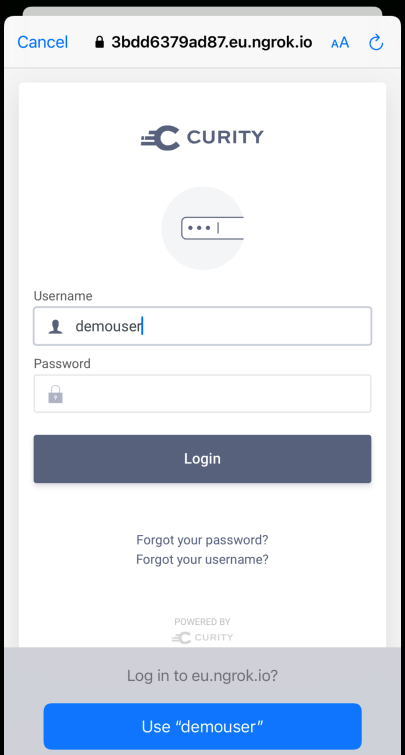

# Curity iOS AppAuth Code Example

[](https://curity.io/resources/code-examples/status/)
[](https://curity.io/resources/code-examples/status/)

Demonstrates how to implement an OpenID Connect mobile client using AppAuth libraries.

## Code Example Article

The [Tutorial Walkthrough](https://curity.io/resources/learn/swift-ios-appauth) explains the complete configuration and behavior.

### Prerequisites

- Sign in to the [Curity Developer Portal](https://developer.curity.io/) with your Github account.
- You can get a [Free Community Edition License](https://curity.io/product/community/) if you are new to the Curity Identity Server.
- Then copy your `license.json` file into the root folder.
- Also ensure that Docker Desktop and [ngrok](https://ngrok.com/docs) are installed.

## Quick Start

Deploy the Curity Identity Server via Docker with settings preconfigured for mobile OAuth.\
An ngrok tunnel enables mobile connectivity to the Identity Server's endpoints.

```bash
./start-idsvr.sh
```

In Xcode run the app by opening the root folder.\
When prompted to sign in, do so as the following preconfigured user account:

- User: `demouser`
- Password: `Password1`

## User Experience

The example mobile app demonstrates OAuth lifecycle events, starting with an `Unauthenticated View`:


Once authenticated the `Authenticated View` show how to work with tokens and sign out:


The example app also demonstrates reliable handling of AppAuth errors.

## Security

AppAuth classes are used to perform the following security related operations accordng to [RFC8252](https://datatracker.ietf.org/doc/html/rfc8252):

* Logins and Logouts via a secure ASWebAuthenticationSession window
* Use of Authorization Code Flow (PKCE)



## Teardown

Run the following commands to free Docker resources:

```bash
./stop-idsvr.sh
```

## More Information

Please visit [https://curity.io](https://curity.io) for more information about the Curity Identity Server.
