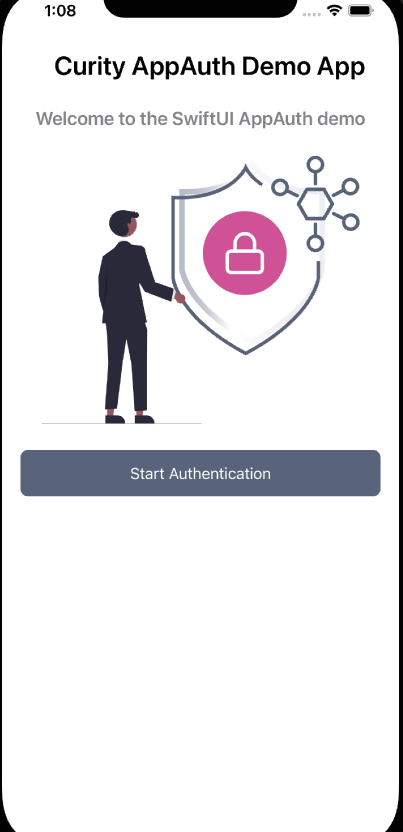
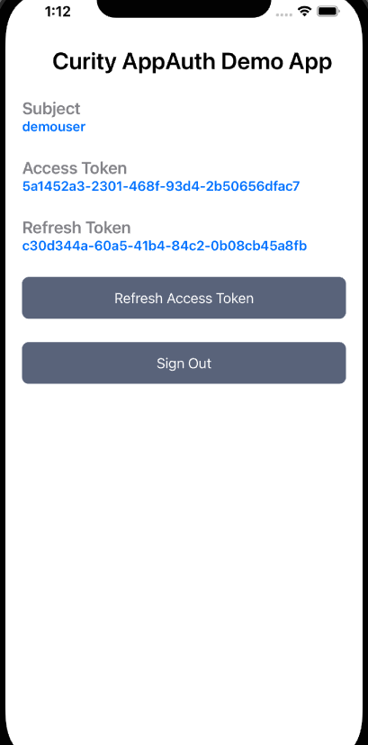

# Curity iOS AppAuth Code Example

Demonstrates how to implement an OpenID Connect mobile client using AppAuth libraries.

## Overview

A simple mobile app that demonstrates OAuth lifecycle events, starting with an `Unauthenticated View`:

Once authenticated the `Authenticated View` show how to work with tokens and sign out:

The example app also demonstrates reliable handling of AppAuth errors.

## Security

AppAuth classes are used to perform the following security related operations:

* Dynamic Client Registration
* Logins and Logouts via an ASWebAuthenticationSession window
* Working with Access Tokens and Token Refresh

## Tutorial

See the [Curity iOS AppAuth Article](https://curity.io/resources/learn/kotlin-ios-appauth/) for full details on how to run the app.

## More Information

Please visit [https://curity.io](https://curity.io) for more information about the Curity Identity Server.